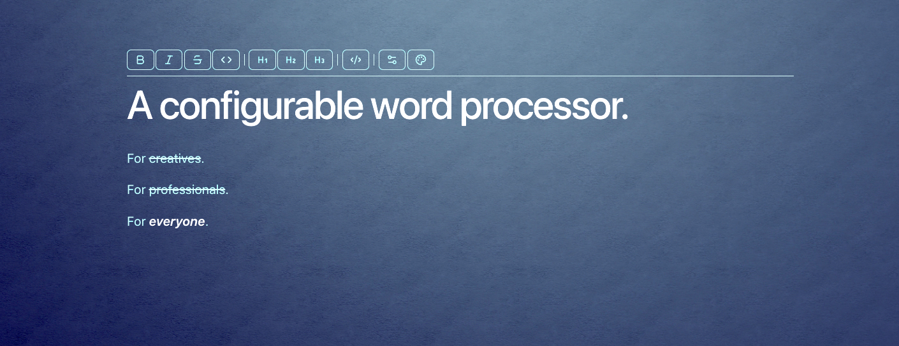

# ProseForge



A configurable word processor for everyone.

ProseForge is a rich-text editor wrapped in a customizable creative space. The 3D writing surface, editor appearance, toolbar styling, and text effects are all configurable — so you can shape the environment around your words, not the other way around.

## Features

- **Rich-text editing** — Bold, italic, strikethrough, inline code, headings, and code blocks
- **3D writing surface** — PBR-textured paper rendered behind the editor with dynamic lighting
- **Configurable editor** — Text and heading colors, background opacity, toolbar theming
- **Dynamic text shadow** — Text shadow direction follows the 3D scene light position
- **Configurable scene** — Material presets, lighting, camera, and background color
- **Persistent config** — Editor and scene settings saved to localStorage; export as JSON
- **Dark mode** — Automatic via `prefers-color-scheme`

## Tech Stack

- **React 19** + **TypeScript** + **Vite**
- **ProseMirror** via `@nytimes/react-prosemirror`
- **Three.js** / **R3F** (`@react-three/fiber` + `@react-three/drei`)
- **Tailwind v4**
- **Effect** (for functional pipelines and error handling)
- **base-ui** (Shadcn-style primitives)

## Getting Started

```sh
bun install
bun run dev
```

## Commands

| Command          | Description                        |
| ---------------- | ---------------------------------- |
| `bun run dev`    | Start dev server with HMR          |
| `bun run build`  | Typecheck + production build       |
| `bun run lint`   | ESLint across the whole project    |
| `tsc -b`         | Typecheck only                     |

## Project Structure

```
src/
  app/              App-level components and layout
  editor/           ProseMirror editor module
    toolbar/          Toolbar component and icons
  editor-options/   Editor appearance configuration panel
  scene/            Three.js / R3F 3D scene module
  scene-options/    Scene configuration panel
  components/       Shared UI components
  hooks/            Custom React hooks
  lib/              Utilities
  assets/           Static assets
```

## Editor Keyboard Shortcuts

| Shortcut            | Action         |
| ------------------- | -------------- |
| `Cmd/Ctrl+B`       | Bold           |
| `Cmd/Ctrl+I`       | Italic         |
| `Cmd/Ctrl+Shift+S` | Strikethrough  |
| `Cmd/Ctrl+``       | Inline code    |
| `Cmd+Shift+7`      | Heading 1      |
| `Cmd+Shift+8`      | Heading 2      |
| `Cmd+Shift+9`      | Heading 3      |
| `Cmd+Shift+\`      | Code block     |
| `Cmd/Ctrl+Z`       | Undo           |
| `Cmd/Ctrl+Shift+Z` | Redo           |

## Roadmap

- [x] ProseMirror rich-text editor
- [x] Immersive 3D writing surface with PBR materials
- [x] Configurable editor appearance and toolbar theming
- [x] Configurable scene (lighting, camera, background)
- [x] Dynamic text shadow from 3D light
- [ ] Plugin system for extensibility
- [ ] Theme marketplace
- [ ] Local-first document storage